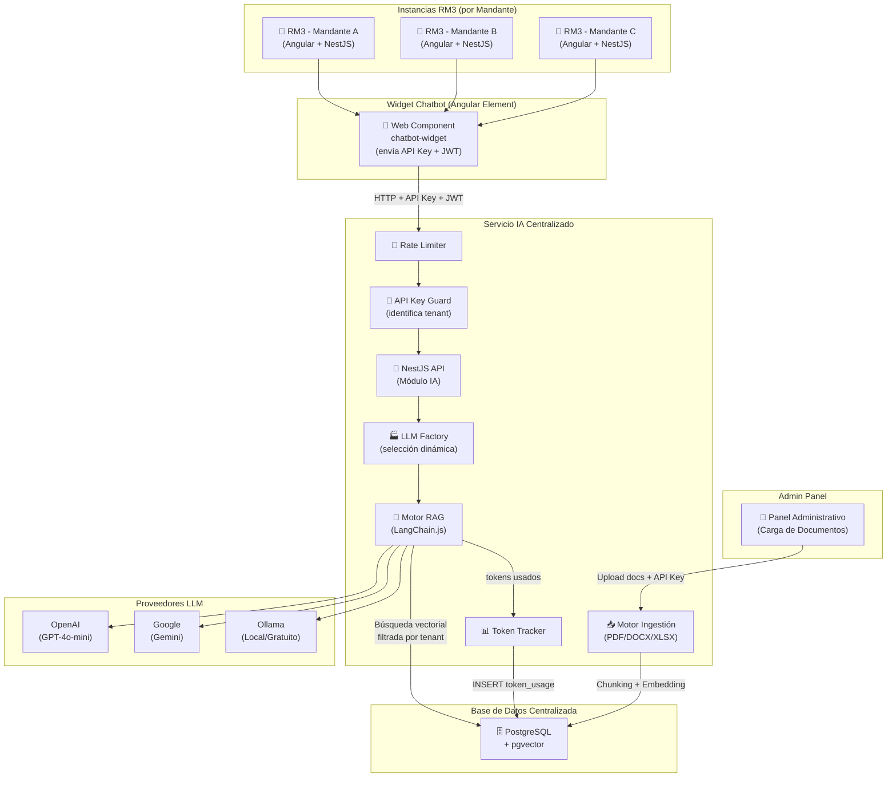
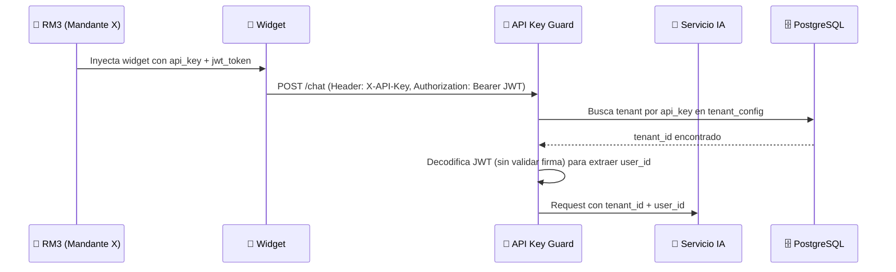
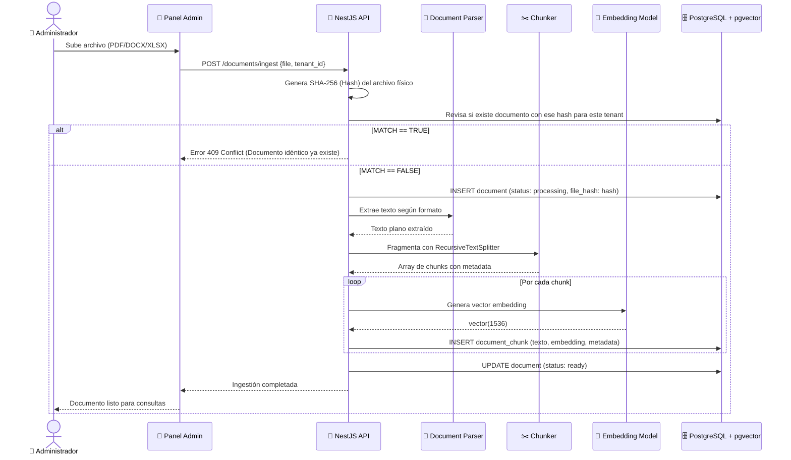
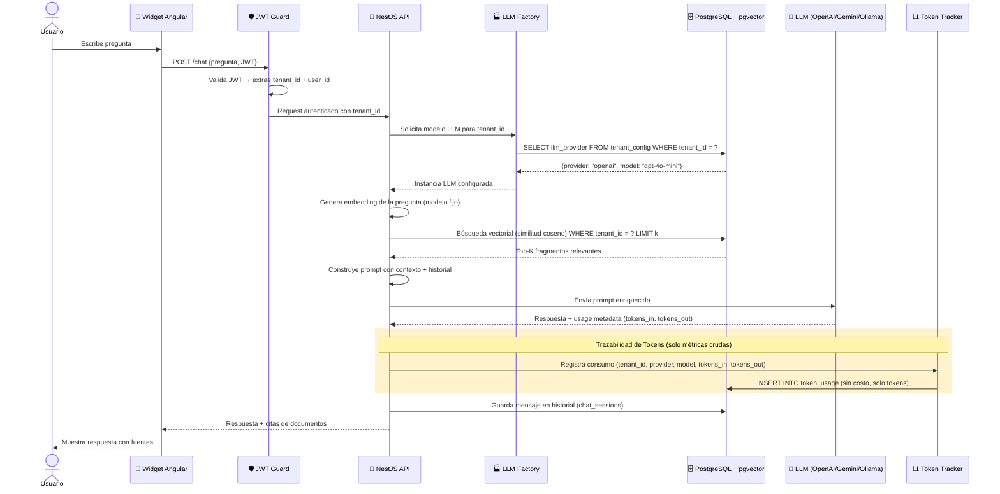
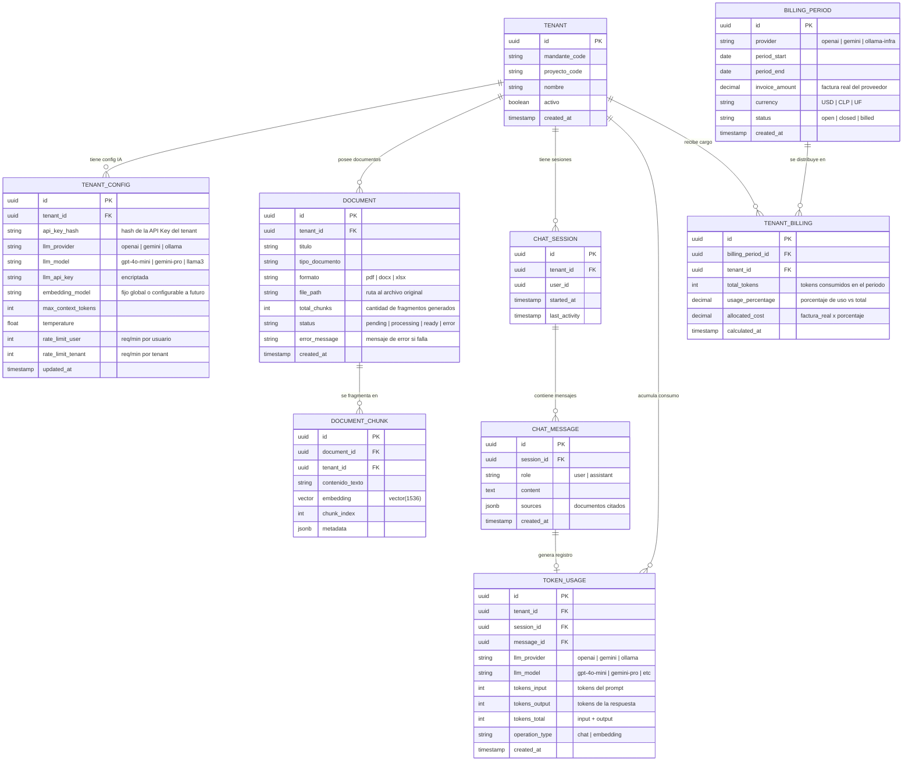
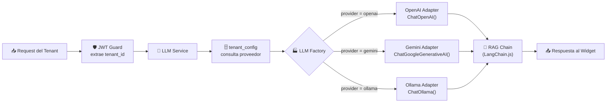
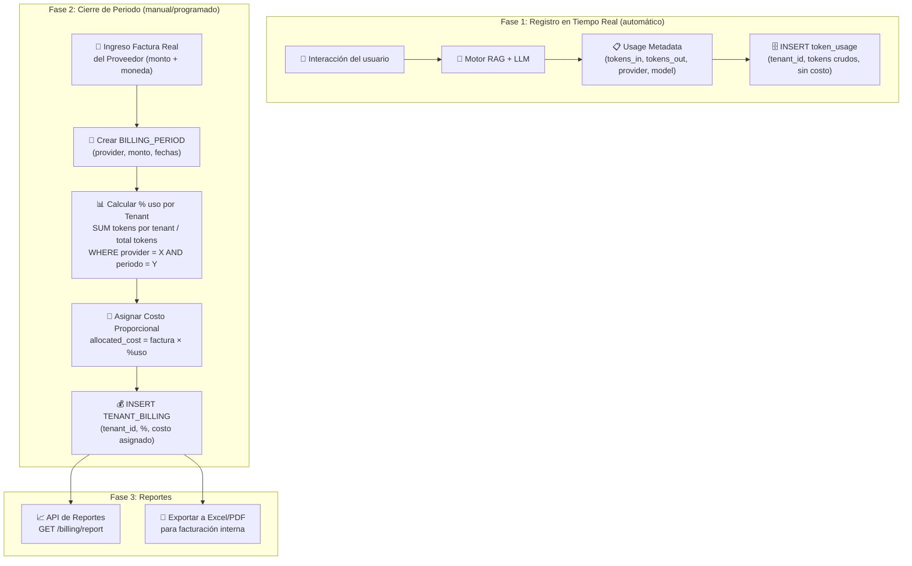
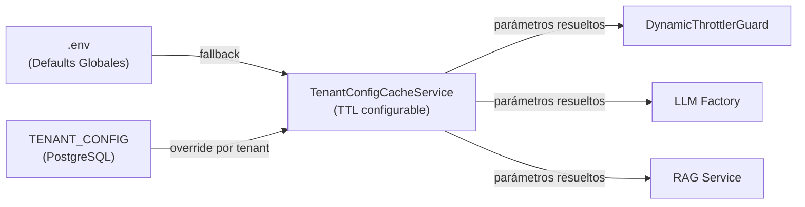

# Especificación Técnica: Chatbot Embebido para Acreditación de Personal

## Resumen Ejecutivo
La solución propuesta es un **widget de chatbot** diseñado para ser embebido (integrado) dentro de la aplicación web **RM3** (Sistema de Acreditación de Trabajadores). Su propósito es asistir a los usuarios respondiendo preguntas específicas relacionadas con los **requerimientos documentales** necesarios para la acreditación de personal (ingreso de contratistas, acceso a faenas, normativas de seguridad, etc.).

El asistente utilizará una arquitectura **RAG (Retrieval-Augmented Generation)** para garantizar que las respuestas sean precisas y estén fundamentadas exclusivamente en las políticas y normativas vigentes proporcionadas, evitando alucinaciones del modelo.

La solución es **centralizada y multi-tenant**: una sola instancia del servicio IA sirve a todas las instancias de RM3, aislando los datos por cada combinación **mandante-proyecto**.

---

## Requerimientos

### Funcionales
| # | Requerimiento | Descripción |
|---|---|---|
| RF-01 | **Interfaz Embebible (Widget)** | Integración en RM3 mediante Web Component (Angular Elements) o `<script>` tag. |
| RF-02 | **Pregunta/Respuesta en Tiempo Real** | Interfaz tipo chat flotante con respuestas inmediatas basadas en IA. |
| RF-03 | **Base de Conocimiento RAG** | Respuestas fundamentadas estrictamente en documentación de acreditación cargada. Sin alucinaciones. |
| RF-04 | **Memoria de Conversación** | Mantener contexto (historial de mensajes) durante la sesión activa del usuario. |
| RF-05 | **Citas y Transparencia** | Indicar el documento o extracto en el cual se basó la respuesta (recomendado). |
| RF-06 | **LLM Dinámico por Tenant** | Permitir configurar el proveedor de LLM (OpenAI, Gemini, Ollama) por cada mandante-proyecto. |
| RF-07 | **Trazabilidad de Consumo de Tokens** | Registrar tokens crudos (input + output) por interacción y tenant. Al cierre de periodo, prorratear la factura real del proveedor según el porcentaje de uso de cada mandante-proyecto. |
| RF-08 | **Ingestión de Documentos** | Interfaz administrativa independiente para cargar documentos (PDF, DOCX, XLSX) por cada mandante-proyecto. Incluye endpoint API de ingestión con procesamiento automático (extracción de texto, chunking, vectorización). |
| RF-09 | **Rate Limiting Dinámico** | Protección contra abuso con límites configurables **por tenant** (req/min por usuario y por tenant). Los valores se leen desde `TENANT_CONFIG` en tiempo de ejecución. El `.env` define valores por defecto globales como fallback. |
| RF-10 | **Manejo de Errores con Trazabilidad** | Ante fallos del LLM o del sistema, mostrar mensaje genérico al usuario y registrar traza interna detallada para soporte. |
| RF-11 | **Respuestas en Español** | El LLM debe responder siempre en español, forzado mediante system prompt del RAG. |

### No Funcionales
| # | Requerimiento | Descripción |
|---|---|---|
| RNF-01 | **Aislamiento CSS/JS** | El widget no interfiere con los estilos ni scripts de la aplicación host RM3. |
| RNF-02 | **Rendimiento** | Tiempo de respuesta < 5 segundos. Bundle del widget ligero. |
| RNF-03 | **Diseño Responsivo** | Adaptación a dispositivos móviles y escritorio. |
| RNF-04 | **Escalabilidad** | Manejo de múltiples consultas concurrentes de distintos tenants. |
| RNF-05 | **MVP Local** | Ejecutable completamente en ambiente local con Docker Compose, sin dependencias de nube. |
| RNF-06 | **Logging Estructurado** | Todos los errores internos se registran con nivel, timestamp, tenant_id, y stack trace para diagnóstico. |
| RNF-07 | **Soporte Multi-formato** | Procesamiento de documentos PDF, DOCX y XLSX para ingestión en la base de conocimiento. |

---

## Arquitectura General

La arquitectura será 100% compatible con el ecosistema actual de **RM3**, diseñada de forma centralizada y multi-tenant.



---

### Frontend (Widget Embebible Angular)
*   **Framework**: **Angular** exportado como Web Component usando **Angular Elements**. Empaquetado en un único archivo `chatbot-widget.js` que se incrusta nativamente en el frontend de RM3.
*   **Estilos**: **Tailwind CSS** con prefijos para aislar utilidades y evitar colisiones con los estilos globales de RM3.
*   **Autenticación**: El widget recibe **API Key** (identifica tenant) + **JWT** (identifica usuario) desde la aplicación host.
*   **Manejo de Errores**: Ante cualquier fallo, muestra: *"No puedo responder en estos momentos. Si el problema persiste, contáctese con el administrador."* Internamente registra la traza completa.

### Panel Administrativo
*   Interfaz web independiente para el **administrador de la plataforma**.
*   Permite cargar documentos (PDF, DOCX, XLSX) asociándolos a un mandante-proyecto específico.
*   Muestra el estado de ingestión de cada documento (pendiente, procesando, listo, error).

### Backend (Servicio IA en NestJS)
*   **Framework API**: **NestJS**. Módulo dedicado para procesar la IA. Para el **MVP**, ejecutable sin dependencias de nube (Docker Compose + `.env`).
*   **ORM y Base de Datos**: **Prisma** → **PostgreSQL con pgvector**. Incluye entidad `TenantConfig` para configuraciones de IA exclusivas por cada mandante-proyecto.
*   **LLM Dinámico**: Soporte multi-proveedor (OpenAI, Gemini, Ollama). Patrón **Factory** con LangChain.js para instanciar el modelo correcto en tiempo de ejecución.
*   **Orquestación IA**: **LangChain.js** integrado como servicio de NestJS para recuperación de contexto y generación de respuestas.
*   **Rate Limiting Dinámico**: Guard personalizado (`DynamicThrottlerGuard`) que extiende `ThrottlerGuard` de `@nestjs/throttler`. En cada request lee los límites desde `TenantConfigCacheService` (ver sección *Gestión de Parámetros Dinámicos*). Los valores globales de fallback se definen en `.env` (`THROTTLE_USER_LIMIT`, `THROTTLE_TENANT_LIMIT`, `THROTTLE_TTL_MS`).
*   **Infraestructura**: Preparado para **AWS** en producción, completamente funcional en local con contenedores.

> ⚠️ **Advertencia Arquitectónica sobre Embeddings**: Si bien el LLM generativo es dinámicamente intercambiable por tenant, el modelo de **embeddings debe ser único y estandarizado** para todos los tenants en el MVP. Modelos distintos generan vectores de dimensiones incompatibles (OpenAI=1536 vs MiniLM=384), lo cual rompería la indexación en `pgvector`. El LLM de chat sí puede variar libremente.

---

## Modelo de Autenticación (MVP)

Dado que cada instancia de RM3 tiene su **propio secreto JWT**, el servicio centralizado no puede validar directamente esos tokens. Para el MVP se utiliza un modelo de **API Key + JWT desacoplado**:



*   **API Key**: Identifica al mandante-proyecto. Se almacena hasheada en `TENANT_CONFIG`. No requiere conocer el secreto JWT de RM3.
*   **JWT de RM3**: Se decodifica (sin validar firma) solo para extraer el `user_id` del usuario actual. La confianza recae en que la API Key ya validó el tenant.
*   **Producción (futuro)**: Migrar a claves asimétricas (RSA/ECDSA) donde RM3 comparte su clave pública con el servicio centralizado.

> ⚠️ **Nota de seguridad MVP**: Decodificar el JWT sin validar firma es aceptable para el MVP porque el canal ya está autenticado por la API Key. Para producción, se debe implementar validación completa.

---

## Ingestión de Documentos

Los documentos de especificación de requerimientos documentales son cargados por un **administrador único de la plataforma** a través del panel administrativo, asociados a un mandante-proyecto específico.

### Formatos Soportados
| Formato | Librería de Extracción | Notas |
|---|---|---|
| **PDF** | `pdf-parse` (Node.js) | Extrae texto plano. Para PDFs escaneados se necesitaría OCR (fuera del MVP). |
| **DOCX** | `mammoth` (Node.js) | Convierte a texto plano preservando estructura de párrafos. |
| **XLSX** | `xlsx` / `exceljs` (Node.js) | Convierte cada fila a texto estructurado (key: value). |

### Estrategia de Chunking (Fragmentación)

Se utiliza **Recursive Character Text Splitting** con overlap, la estrategia más robusta para documentos normativos/regulatorios:

| Parámetro | Valor MVP | Razón |
|---|---|---|
| `chunk_size` | **800 tokens** (~3.200 caracteres) | Balance entre contexto suficiente y precisión en la búsqueda vectorial. |
| `chunk_overlap` | **200 tokens** (~800 caracteres) | Evita cortar oraciones o ideas a la mitad entre chunks consecutivos. |
| `separators` | `["\n\n", "\n", ". ", " "]` | Prioriza cortar por párrafos, luego líneas, luego oraciones. |

> 💡 **Caso especial XLSX**: Las hojas de cálculo no se fragmentan con text splitting. Cada **fila** se convierte en un chunk independiente con formato `"Columna1: valor1, Columna2: valor2, ..."`, preservando la integridad de cada registro.

### Flujo de Ingestión



### Limpieza de Archivos (Políticas de Auditoría Transitoria)
Para soportar eventualidades y re-intentos de ingesta sin obligar al usuario a subir los PDFs pesados de nuevo, el `MulterModule` se pre-configuró con Persistencia Local (carpeta `/uploads/`).
Para impedir cuellos de botella Out Of Memory (OOM), el Gateway del servidor bloqueará por fuerza mayor de RAM a aquellos archivos que excedan  `MAX_UPLOAD_MB=10` (variables de entorno).

Adicionalmente, se ejecuta un proceso asíncrono (CRON Nocturno) con `@nestjs/schedule` para liberar memoria de almacenamiento, borrando del Sistema Operativo todos los archivos físicos que contengan antigüedades superiores a las **48 horas inyectadas** sin alterar la metadata en PostgreSQL.

## Flujo de Procesamiento RAG



---

## Modelo de Datos



---

## Patrón Factory: Selección Dinámica de LLM



---

## Trazabilidad de Consumo y Prorrateo de Facturación

El sistema utiliza un modelo de **Prorrateo Proporcional por Uso Real** (*Proportional Cost Allocation*), el cual está fuertemente diseñado para soportar que un mismo tenant pueda utilizar múltiples proveedores de IA (ej. OpenAI y Gemini) en un mismo periodo. En lugar de estimar costos por token, el sistema opera así:

1.  **Registra tokens crudos** por cada interacción, adjuntando siempre qué `llm_provider` y `llm_model` procesó dicha petición (sin calcular costos al vuelo).
2.  **Al cierre del periodo**, el administrador ingresa la **factura real** de cada proveedor de forma independiente (ej: Ingresa factura de OpenAI, luego factura de Google).
3.  **Calcula automáticamente** el porcentaje de uso de cada tenant **particionado por proveedor**.

### Comportamiento Multi-Proveedor
Si a mitad de mes el administrador cambia el motor LLM de un `tenant` (ej. pasa de OpenAI a Gemini), el sistema registrará el consumo para cada proveedor de manera aislada. Al final del periodo, ese `tenant` recibirá **cobros fraccionados e independientes**: uno calculado sobre la factura de OpenAI, y otro sobre la porción de uso de la factura de Gemini.

### Ventajas del modelo
*   ✅ **Tolerancia a Cambios en Caliente**: Cobro matemático exacto incluso si la configuración del proveedor en el tenant cambia múltiples veces durante el mes.
*   ✅ **Sin tabla de precios que mantener**: no importa si el proveedor cambia o ajusta sus tarifas por token.
*   ✅ **Precisión total**: se reparte la factura agregada real.
*   ✅ **Agnóstico a moneda**: la factura base se carga en USD, CLP, UF.

> ⚠️ **Limitación conocida**: No hay visibilidad del gasto monetario en tiempo real para el tenant. Solo conocerá su consumo de "tokens". El valor monetario nace al cierre tras ingresar la factura de nube.

### Ejemplo Numérico (Caso Tenant Híbrido)

Supongamos que el **Proyecto 1** empezó el mes con OpenAI y luego se le cambió a Gemini:

| Tenant | Proveedor | Tokens consumidos | % del volúmen total (por proveedor) | Factura real ingresada | Costo asignado |
|---|---|---|---|---|---|
| Mandante A - Proyecto 1 | **OpenAI**| 150.000 | 30% | $50.00 USD (OpenAI)| **$15.00 USD** |
| Mandante A - Proyecto 2 | **OpenAI**| 350.000 | 70% | — | $35.00 USD |
| Mandante A - Proyecto 1 | **Gemini**| 50.000  | 100% | $10.00 USD (Google)| **$10.00 USD** |
| **TOTAL FACTURADO** | | | | **$60.00 USD** | **$60.00 USD** |

### Flujo de Prorrateo Proporcional



### Implementación Técnica

*   **Interceptor de NestJS (Fase 1)**: Un interceptor global captura el metadata de uso (`usage.prompt_tokens`, `usage.completion_tokens`) que retorna cada proveedor LLM. Se registra de forma **asíncrona y no bloqueante** en `token_usage` (solo tokens crudos, sin cálculo de costos).
*   **Servicio de Facturación (Fase 2)**: El `BillingService` se invoca al cierre de periodo (manualmente o vía cron job). Recibe el monto de la factura real, calcula los porcentajes de uso por tenant y genera los registros de `TENANT_BILLING`.
*   **API de Reportes (Fase 3)**:
    *   `GET /usage/report?tenant_id=X&from=Y&to=Z` — Consumo de tokens crudos (disponible siempre).
    *   `GET /billing/report?period_id=X` — Costo asignado por tenant (disponible solo después del cierre).
    *   `POST /billing/period` — Registrar una factura real de proveedor y disparar el prorrateo.

---

## Gestión del Estado

### Frontend (Widget)
*   Estado interno (historial de mensajes, loading, abierto/cerrado) administrado mediante **Signals** o **RxJS BehaviorSubjects** nativos de Angular.
*   El Web Component recibe **API Key** + **JWT** como input properties de la app host, enviándolos en cada llamada HTTP al backend.
*   Ante errores, muestra: *"No puedo responder en estos momentos. Si el problema persiste, contáctese con el administrador."*

### Backend
*   **API Key Guard de NestJS** identifica al tenant mediante la API Key. El JWT se decodifica para extraer el `user_id`.
*   **Multi-tenant**: El `tenant_id` (derivado de la API Key) se usa como filtro estricto en Prisma (Data Isolation).
*   **Rate Limiting Dinámico**: `DynamicThrottlerGuard` consulta `TenantConfigCacheService` para obtener los límites del tenant activo. Si el tenant no tiene configuración propia, se usan los valores del `.env`. Los límites se pueden actualizar sin reiniciar el servicio (invalidan la caché).
*   **Logging Estructurado**: Todos los errores se registran con nivel, timestamp, tenant_id y stack trace.
*   El historial de conversación se registra en las tablas `chat_session` y `chat_message` de PostgreSQL a través de Prisma.
*   El system prompt del RAG fuerza respuestas en **español**.

---

## Gestión de Parámetros Dinámicos por Tenant

Todos los parámetros operacionales del servicio siguen una **jerarquía de configuración en dos niveles** que permite administrarlos en tiempo de ejecución sin reiniciar el servicio:



### Jerarquía de Configuración

| Nivel | Fuente | Alcance | Actualización |
|---|---|---|---|
| **1 (base)** | `.env` | Global (todos los tenants) | Requiere reinicio del servicio |
| **2 (override)** | `TENANT_CONFIG` en PostgreSQL | Por tenant (mandante-proyecto) | En caliente, sin reinicio |

### TenantConfigCacheService

Servicio singleton que actúa como capa de caché en memoria para la configuración por tenant:

*   **Caché en memoria** (`Map<tenant_id, TenantConfig>`) con TTL configurable (`CACHE_TTL_MS` en `.env`, default: 5 minutos).
*   **Resolución lazy**: En el primer request de un tenant, carga su config desde la BD y la almacena en caché.
*   **Invalidación explícita**: El endpoint `PUT /tenants/:id/config` invalida la entrada de caché del tenant afectado inmediatamente, garantizando que el siguiente request use los nuevos valores.
*   **Concurrencia segura**: Las lecturas son no bloqueantes. Las escrituras usan locking optimista vía Prisma.

### Parámetros administrados dinámicamente

| Parámetro | Campo en `TENANT_CONFIG` | Variable `.env` (fallback) | Descripción |
|---|---|---|---|
| Límite req/min por usuario | `rate_limit_user` | `THROTTLE_USER_LIMIT=30` | Peticiones máximas por usuario por minuto |
| Límite req/min por tenant | `rate_limit_tenant` | `THROTTLE_TENANT_LIMIT=200` | Peticiones máximas totales del tenant por minuto |
| Proveedor LLM | `llm_provider` | `DEFAULT_LLM_PROVIDER=openai` | Motor generativo (openai, gemini, ollama) |
| Modelo LLM | `llm_model` | `DEFAULT_LLM_MODEL=gpt-4o-mini` | Versión del modelo a usar |
| Temperatura LLM | `temperature` | `DEFAULT_LLM_TEMPERATURE=0.2` | Creatividad de las respuestas |
| Tokens de contexto | `max_context_tokens` | `DEFAULT_MAX_CONTEXT_TOKENS=4000` | Tamaño máximo del contexto RAG |

### DynamicThrottlerGuard (Rate Limiting)

Guard personalizado que extiende `ThrottlerGuard` de `@nestjs/throttler`:

```
DynamicThrottlerGuard.canActivate(context)
  └─ extrae tenant_id del request (previamente inyectado por ApiKeyGuard)
  └─ llama TenantConfigCacheService.getConfig(tenant_id)
  └─ obtiene { rate_limit_user, rate_limit_tenant } (con fallback a .env)
  └─ genera claves de caché separadas: "user:{user_id}" y "tenant:{tenant_id}"
  └─ evalúa ambos límites; rechaza con HTTP 429 si cualquiera se supera
```

> 💡 **Patrón extensible**: Este mismo patrón (`CacheService` + guard/service que resuelve config en tiempo de ejecución) aplica para cualquier parámetro futuro que requiera configuración por tenant, como quotas de documentos, idioma de respuesta, o modelos de embedding.

---

## Alcance del MVP

### ✅ Incluido en el MVP
| Feature | Detalle |
|---|---|
| Chat RAG funcional | Widget embebible con preguntas/respuestas basadas en documentos |
| 1 proveedor LLM configurado | OpenAI (GPT-4o-mini) como default. Factory preparado para más |
| Ingestión de documentos | Panel admin básico + endpoint API para PDF, DOCX, XLSX |
| Token tracking | Registro de tokens crudos por interacción y tenant |
| Billing básico | Prorrateo proporcional con ingreso manual de factura |
| Rate limiting | Protección básica contra abuso |
| Docker local | Toda la solución levanta con `docker-compose up` |
| Datos de prueba | Documentos de ejemplo anonimizados para demostración |

### ❌ Fuera del MVP
| Feature | Razón |
|---|---|
| Dashboard visual de reportes | Se prioriza la API. Dashboard es iteración posterior |
| Múltiples proveedores LLM simultáneos | El Factory está listo, pero solo se configura 1 para el MVP |
| Validación JWT con clave asimétrica | Requiere coordinación con equipos de RM3 |
| OCR para PDFs escaneados | Complejidad adicional significativa |
| Exportación Excel/PDF de reportes | Iteración posterior al MVP |

---

## Estructura de Carpetas del Proyecto (MVP)

```
app_build/
├── backend/                          # NestJS
│   ├── src/
│   │   ├── auth/                     # Módulo API Key Guard
│   │   ├── chatbot/                  # Módulo principal del chatbot
│   │   │   ├── chatbot.controller.ts
│   │   │   ├── chatbot.service.ts
│   │   │   ├── llm-factory.service.ts  # Factory dinámico
│   │   │   ├── token-tracking.service.ts # Trazabilidad de tokens
│   │   │   └── rag.service.ts          # Cadena RAG
│   │   ├── documents/                # Módulo de ingestión de documentos
│   │   │   ├── documents.controller.ts # Upload + ingest API
│   │   │   ├── documents.service.ts   # Lógica de ingestión
│   │   │   ├── parsers/               # Extractores por formato
│   │   │   │   ├── pdf.parser.ts
│   │   │   │   ├── docx.parser.ts
│   │   │   │   └── xlsx.parser.ts
│   │   │   └── chunker.service.ts     # Estrategia de fragmentación
│   │   ├── tenant/                   # Módulo de configuración por tenant
│   │   ├── billing/                  # Módulo de facturación y reportes
│   │   │   ├── billing.controller.ts  # API de reportes y cierre de periodo
│   │   │   └── billing.service.ts     # Prorrateo proporcional y cálculos
│   │   ├── common/                   # Utilidades compartidas
│   │   │   ├── filters/               # Exception filters (error handling)
│   │   │   ├── interceptors/          # Logging interceptor
│   │   │   └── guards/                # Rate limit guard
│   │   ├── prisma/                   # Módulo Prisma
│   │   └── main.ts
│   ├── prisma/
│   │   ├── schema.prisma             # Modelo de datos
│   │   └── seed.ts                   # Datos de prueba
│   ├── uploads/                      # Archivos subidos (montaje Docker)
│   ├── .env.example
│   ├── package.json
│   ├── Dockerfile
│   └── tsconfig.json
├── frontend/                         # Angular Widget + Admin Panel
│   ├── src/
│   │   ├── app/
│   │   │   ├── chatbot/              # Componente widget del chat
│   │   │   ├── admin/                # Panel de carga de documentos
│   │   │   └── services/             # Servicios HTTP
│   │   └── main.ts                   # Bootstrap como Web Component
│   ├── package.json
│   ├── Dockerfile
│   └── angular.json
├── docs/                             # Documentos de prueba anonimizados
├── docker-compose.yml                # PostgreSQL + Backend + Frontend
└── README.md
```
